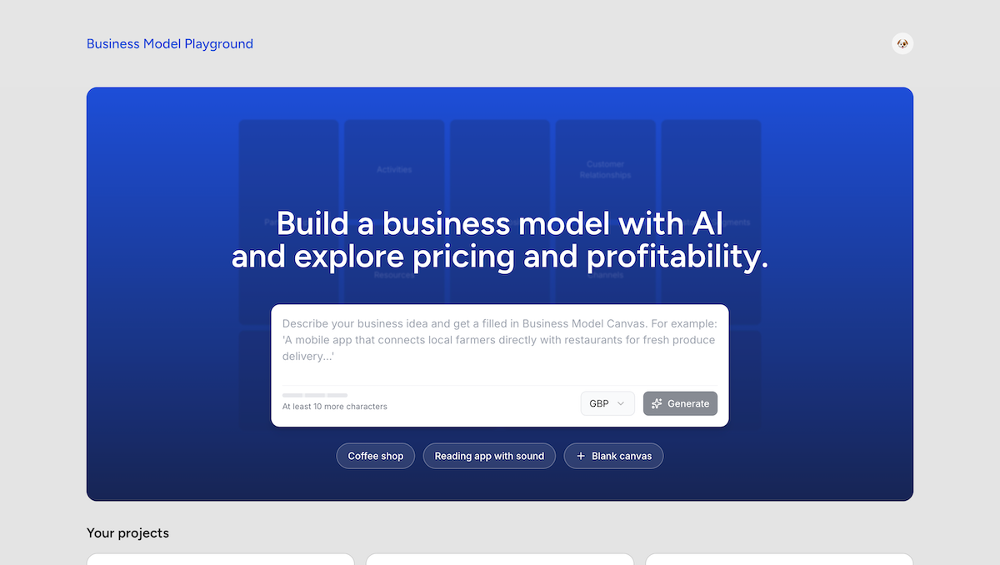

# Business Model Playground
https://business-model-playground.vercel.app/

This website turns the Business Model Canvas framework by Strategyzer into an interactive playground with an AI assistant (powered by OpenAI) and easy-to-use financial calculation and visualisation tools.

The AI Assistant helps you add ideas to your Business Model Canvas and can review your work or dive deeper into the ideas. (Built using Vercel AI SDK)

This is a personal side project to explore the design and development of AI and agentic features.

The AI Assistant in this app has multiple tools available to read and edit the business model canvas data.

This App is also a playground for different development methods and over time I have used custom .md files to keen an AI on track and more conventional emerging methods such as CLAUDE.md, as well as Claude and Cursor plans. I'm also experiemting with tools to improve the quality of AI generated code, namely Tessl, in this app.